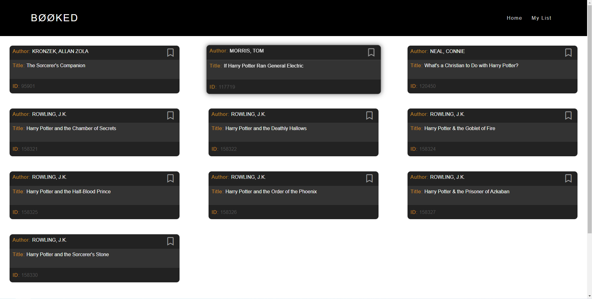
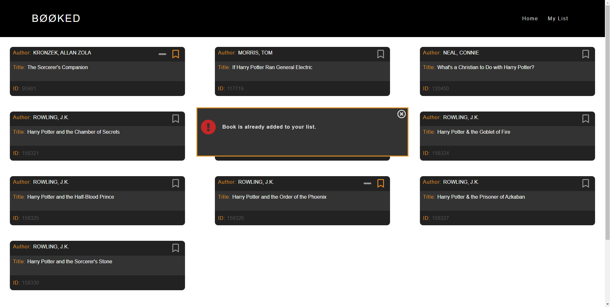
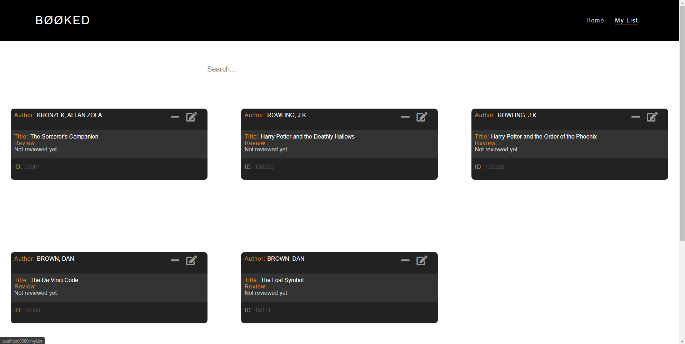
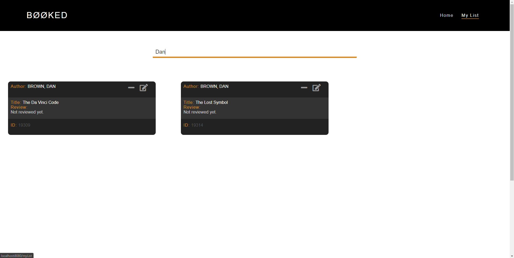
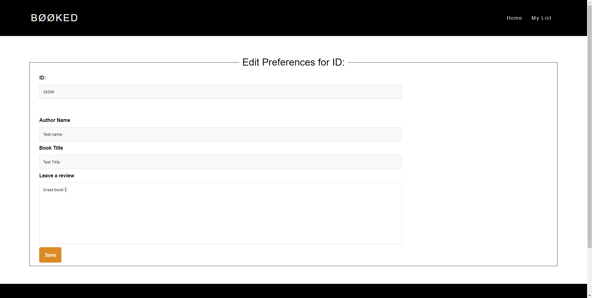
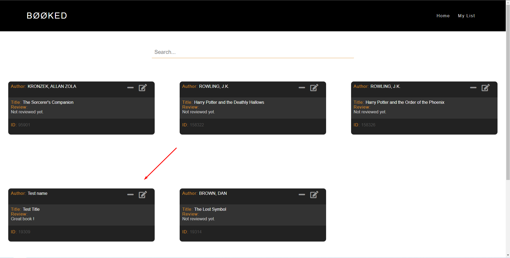
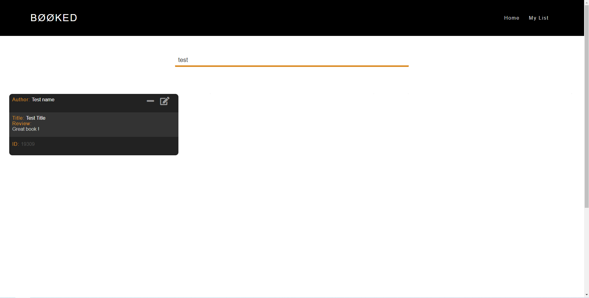

Dynamic E-Bookstore  
✔️Implemented using Express API / NodeJS / Handlebars 
✔️Dynamic Website (Handlebars) 
✔️Server/Client (NodeJS)  
✔️Fully Responsive 
✔️Modern Design  

-<b><ins>Index/Search page</ins></b>  
 
-<b><ins>Footer</ins></b>  
  
-<b><ins>Results / BookPage</ins></b>  
On this page, user can add/remove some books from his list  
 
  
-<b><ins>List/ MyListPage</ins></b> 
On this page, user can see the saved books. He can remove them, edit their preferences or even search  
for a specific book among his list. 
 
 
 
 
 
 
