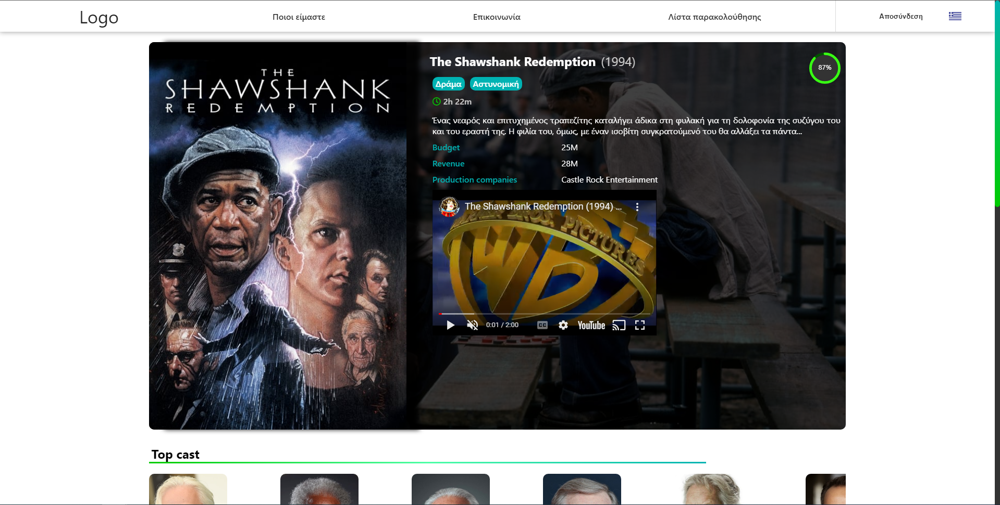
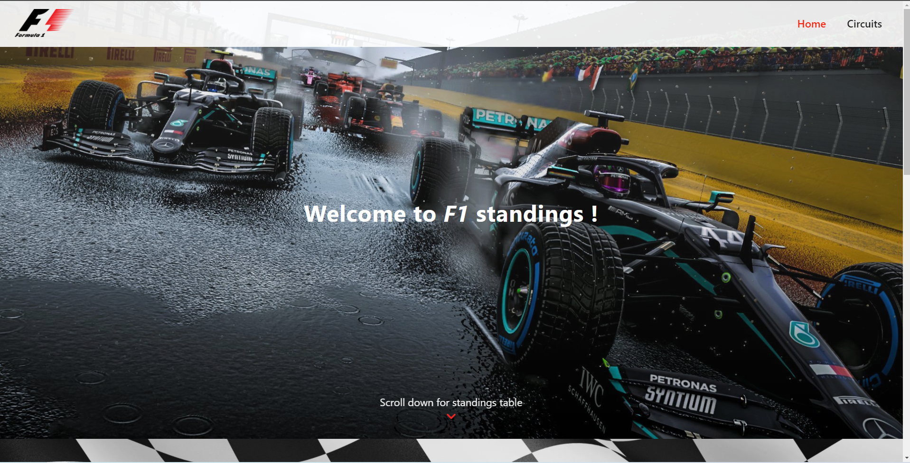
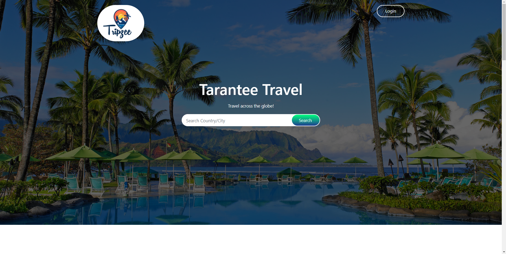

# Web-Development-Projects
In this repository you can find some Website Templates that I've created. 
 
✔️Dynamic Websites  
✔️Responsive Websites  
💻 HTML, CSS, JS,React, Handlebars, Express API, NodeJS  

Take a sneak 👀   

## Movie Data Base Singlepage Web Application (React, Hooks, API) 
  

## F1 Web Application (React, MUI, API) 
  

## Dynamic E-Bookstore (NodeJS, Handlebars, API) 
  

## Login/Register Template (HTML, CSS, Fully-Responsive) 
  

## Travel Website (HTML, CSS, Fully-Responsive) 
  

## Static Blog (HTML, CSS, Fully-Responsive) 
  
