# Formula 1 Web Application
✔️ Fully responsive  
✔️ React  
✔️ MUI  
✔️ API  
## F1 standings is a web application that uses <b>Ergast Api</b> (http://ergast.com/mrd/).  

## Homepage
  

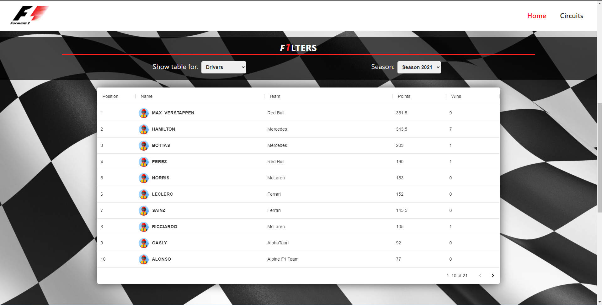  
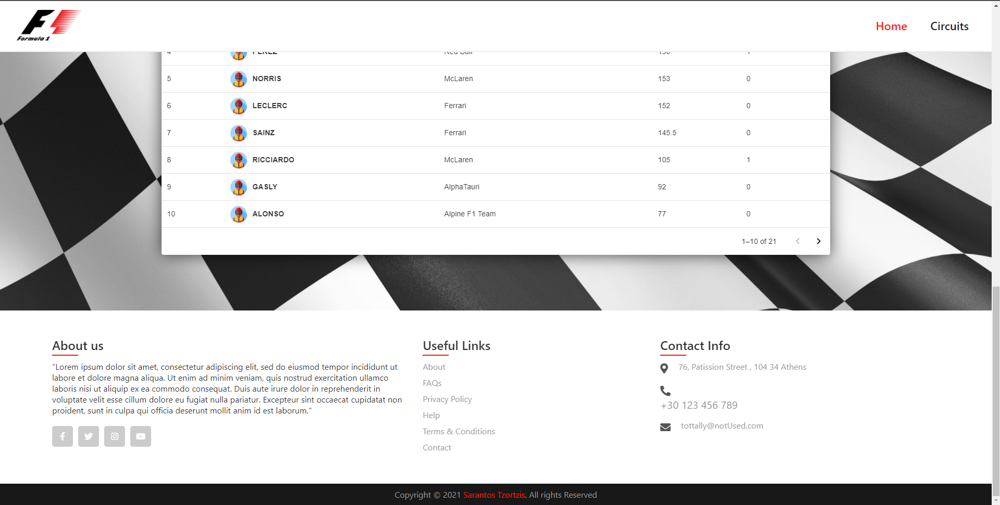  
### User is able to change between <b>Drivers</b> standings table and <b>Constructors</b> standings table or even between different season (2010-current). 
  
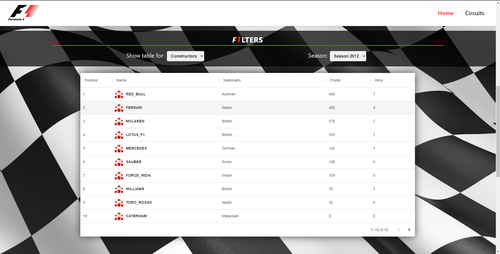  
### When he clicks on a <b>Driver</b> he is being navigated to <b>Drivers Profile Page</b> where he can see more details about the driver and even a table which shows the driver's standings for the period that user chose on the previous table. 
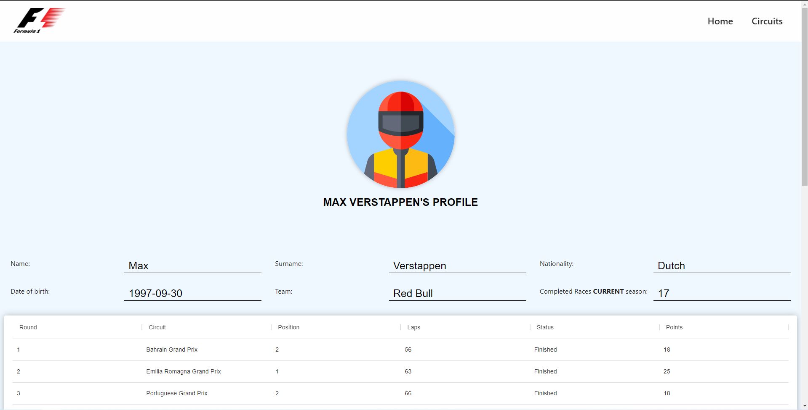  
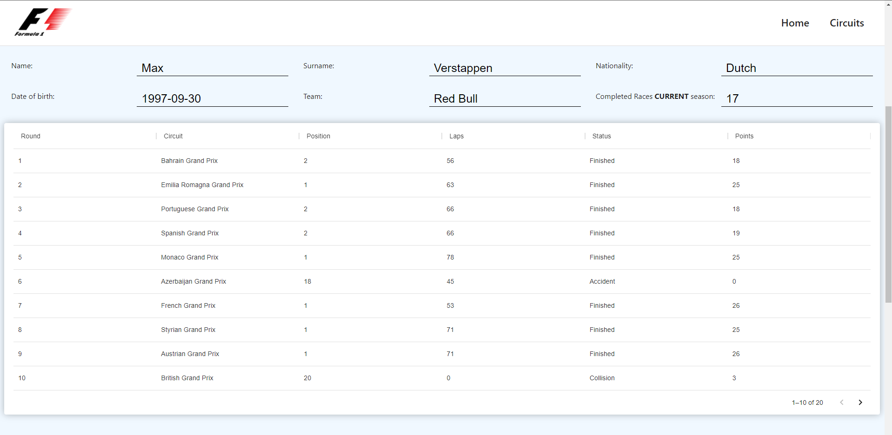  
### When he clicks on a <b>Constructor</b> he is being navigated to <b>Constructos Profile Page</b> where he can see more details about the constructor and even a table which shows the constructor's standings for the period that user chose on the previous table. 
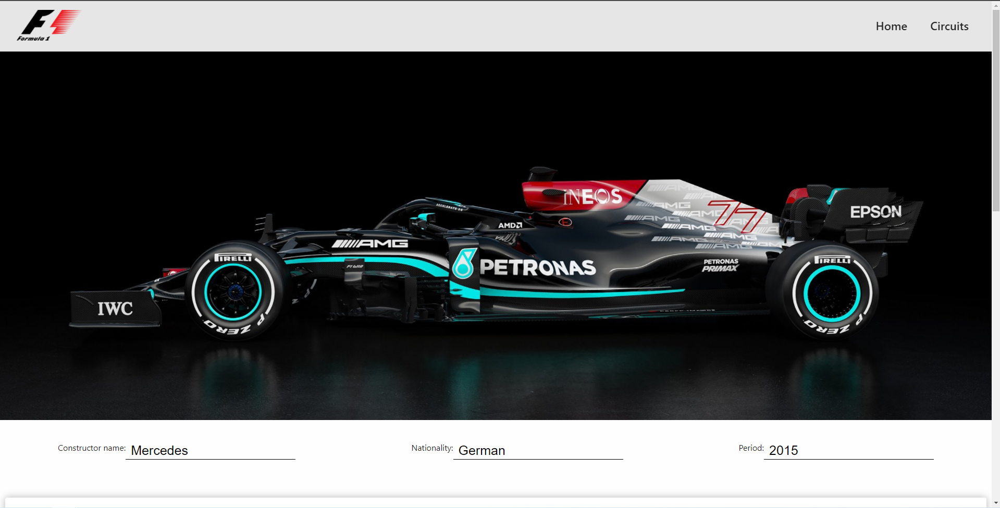  
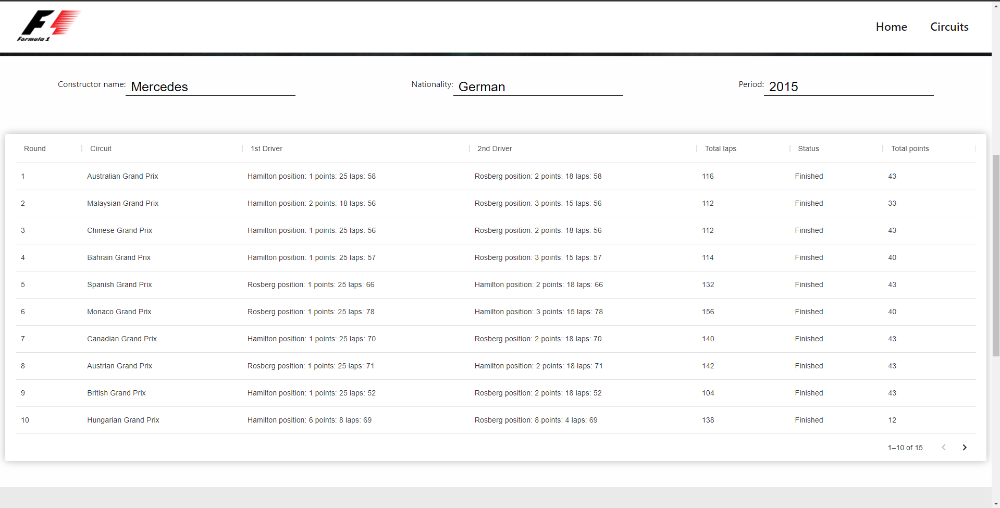  
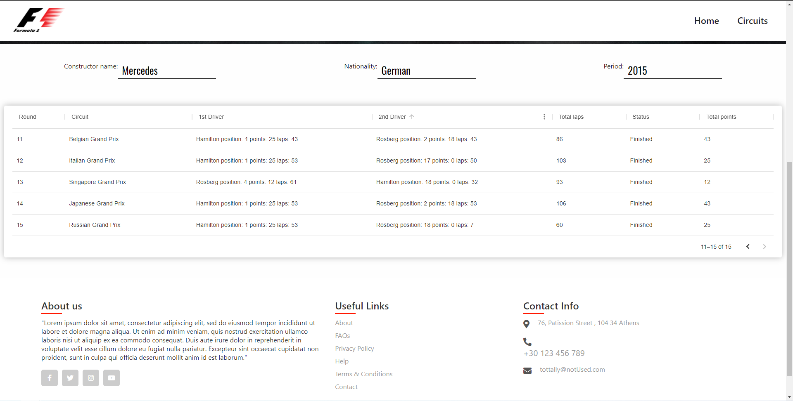  
## Circuits Page
### Along with standings, there is a <b>Circuits</b> page where there are static data for some F1 circuits.  
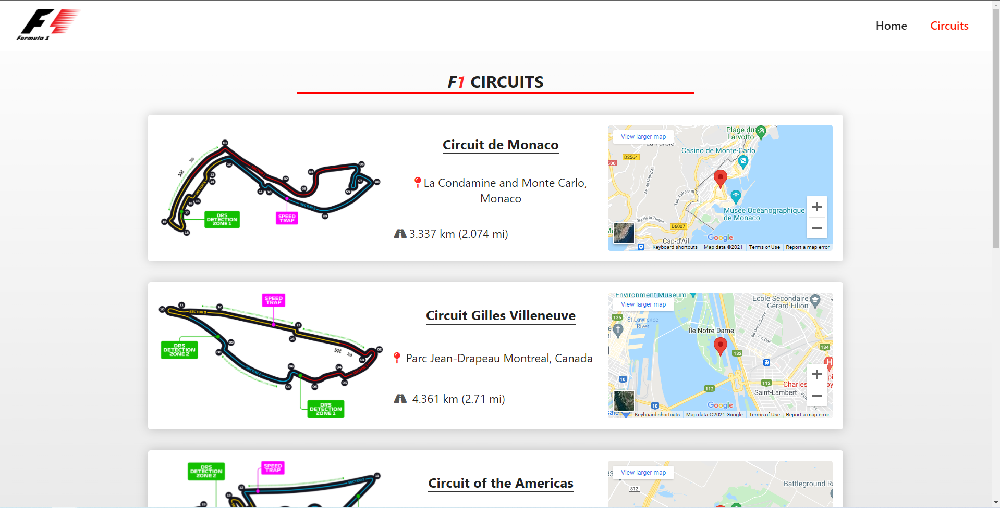  
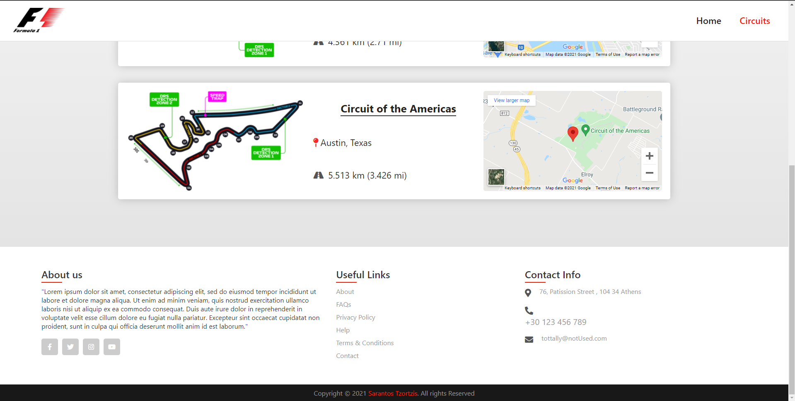  

### As mentioned, this application is fully responsive for smaller screens and mobile devices 
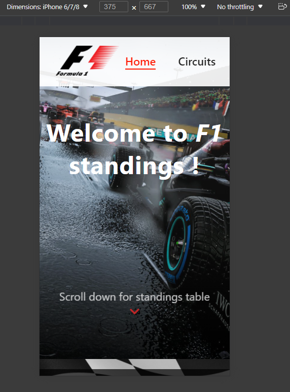  
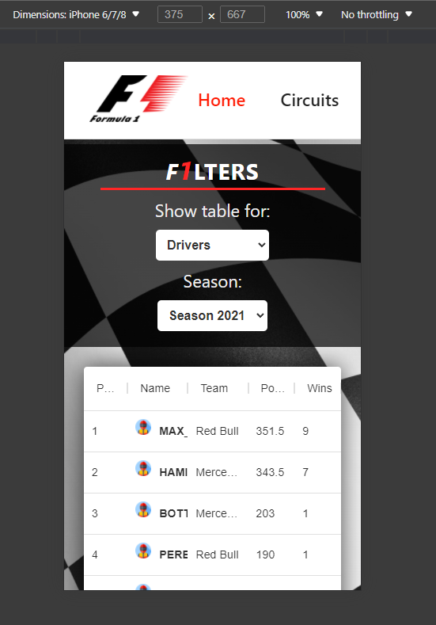  
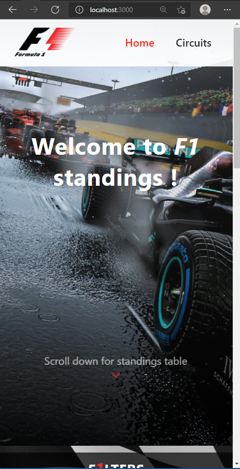  
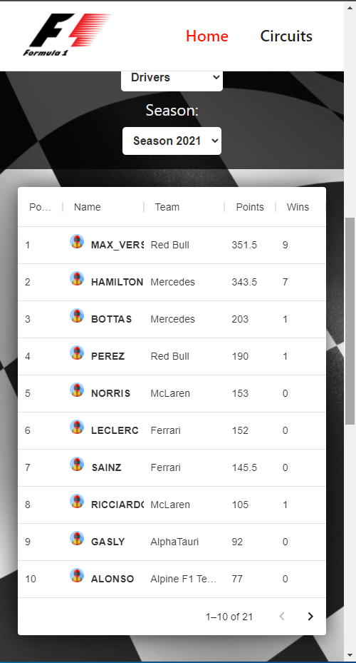  
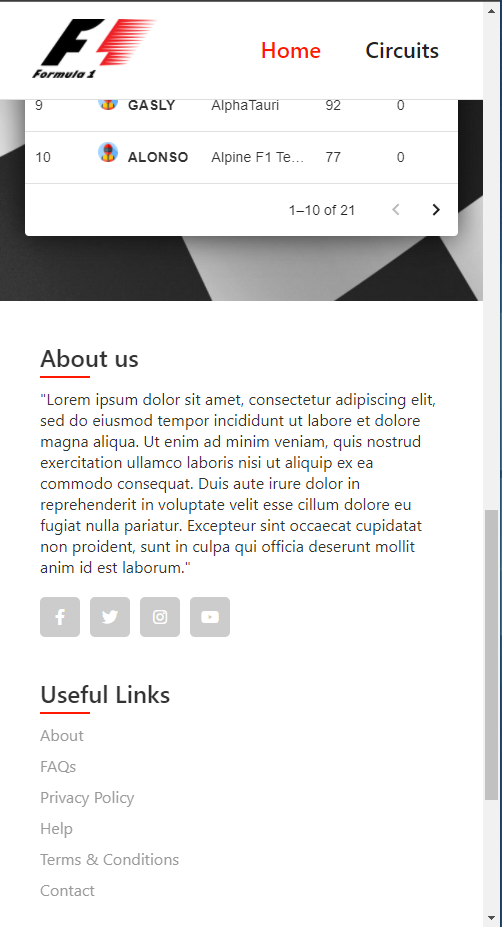  
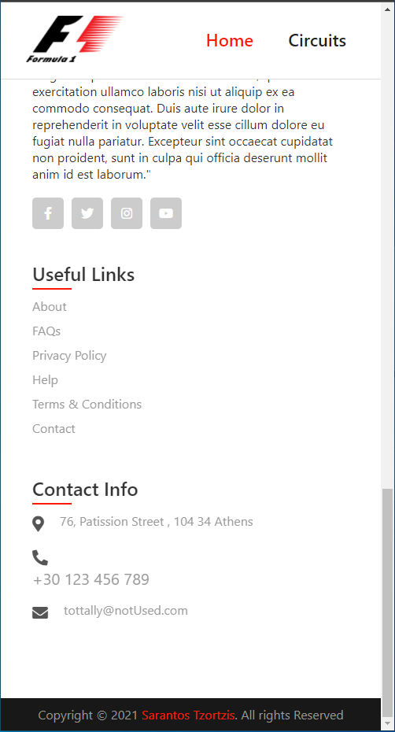  
