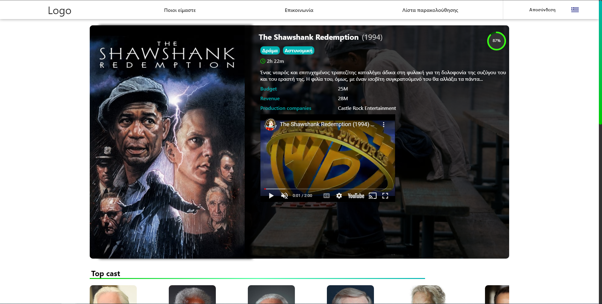
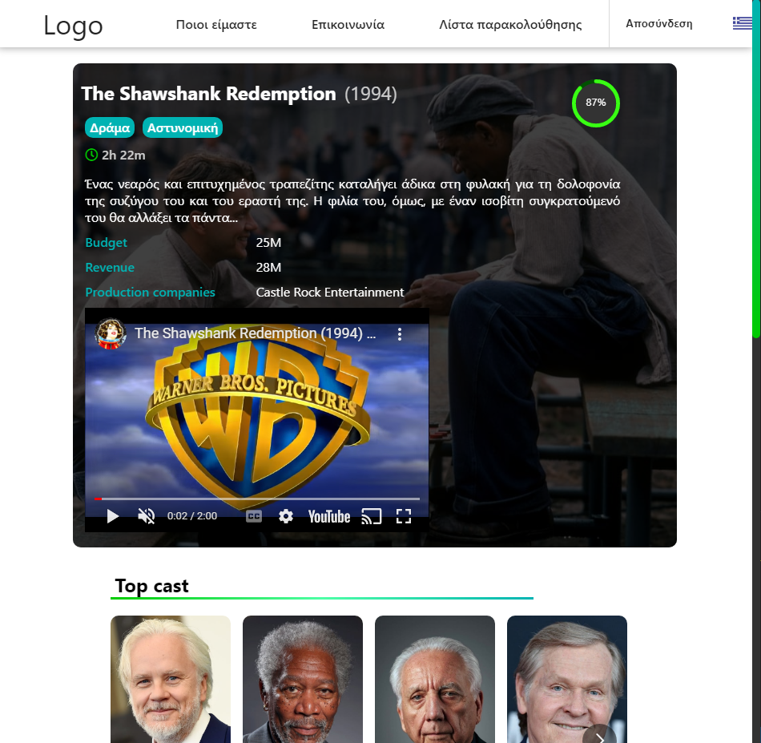

# Formula 1 Web Application
<b> In order to run the App, first you need to execute "npm install" and then "npm start" ( Speed coding, implemented within a day ) </b>  
✔️ Fully responsive  
✔️ React  
✔️ Hooks (Context, State, useEffect)  
✔️ API  
✔️ Carousels  
## Movie Data Base is a single page web application that uses <b>TheMovieDB Api</b> (https://developers.themoviedb.org/3/getting-started/introduction).  

## Login
  
## Homepage

  
## Movie Preview
-Movie information, trailer, genre, rating
  
-Top cast & reviews
  
-Suggested movies
  
## TV-Show Preview
  
-Selecting Different seasons dynamically changes the content
  
## Responsive
  
  
